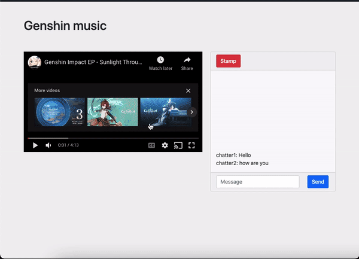
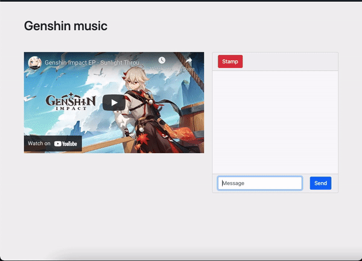

# tip-tube

A full stack web application for users who want to chat about a specific video in realtime.

I created tip-tube because I wanted to try my hand at recreating a web application that was previously called flow-feedback.  My group of friends used to use flow-feedback to analyze Youtube videos and talk about them in detail, and I wanted to create a place that could replicate that experience.
## Live Demo

Try the application live at https://tip-tube.herokuapp.com/
## Technologies Used

- React.js
- Node.js
- PostgreSQL
- Express.js
- JavaScript
- Html5
- CSS3
- React Bootstrap
- Babel
- Webpack
- PGweb
- Heroku
- ReactPlayer

## Preview



## Features

- User can create a room with a name
- User can view the room
- User can create a username when they join the room
- User can create a comment
- User can view the messages in a room
- User can see comments being made in real time
- User can get the time of the Youtube video
- User can click on the timestamp and jump to the time of the video

## Stretch Features
- User can see rooms and join them
- User can edit comments they've made
- User can delete comments they've made

### Getting Started

1. Clone the repository
```shell
git clone https://github.com/a-plasencia/Final-Project.git
cd Final-Project
```

2. Install all dependencies with NPM
```shell
npm install
```

3. Make a copy of the provided .env.example file
```shell
cp .env.example .env
```

4. Start PostgreSQL
```shell
sudo service postgresql start
```

5. Create a database
```shell
createdb Final-Project
```

6. Import the database schema
```shell
npm run db:import
```

7. Start the project.  Once started you can view the application by opening http://localhost:3000 in your browser.
```shell
npm run dev
```
